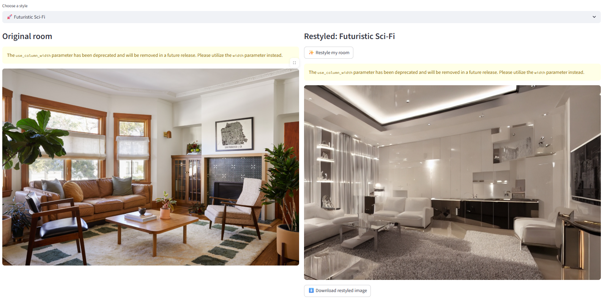

# AI-Powered Interior Restyling: Automated Room Makeover Using Generative Computer Vision
Using advanced computer vision and generative AI models—including Stable Diffusion, Diffusers, PyTorch, and OpenCV—to transform interior room photographs into photorealistic restyled designs while preserving the original spatial layout.

## Overview and Background
Restyling an interior space traditionally requires professional design expertise, manual rendering, and time-consuming 3D workflows. Recent advances in generative computer vision, particularly Stable Diffusion’s image-to-image capabilities, enable realistic, high-quality visual transformations from a single photograph. By guiding the model with curated interior-design style prompts, it becomes possible to alter furniture, materials, colors, and ambiance while preserving the room’s original geometry and camera perspective.

This project leverages diffusion models, PyTorch, and custom prompt engineering to automatically generate magazine-quality room makeovers in a wide range of styles. Users upload a room photo, select a design direction, and the system produces a photorealistic transformation consistent with real-world textures and lighting. The goal is to demonstrate how generative AI can democratize interior design, enabling non-technical users to visualize professional-level makeovers instantly.


## Table of Contents
```
home-make-over
|__ images
|   |__ living_room_input.png 
|   |__ working.png
|__ src
    |__ app.py
    |__ makeover.py
    |__ styles.py
    |__ utils.py
README.md
LICENSE
requirements.txt
```

## Getting started

### Resources used
A high-performance Acer Nitro 5 laptop, powered by an Intel Core i7 processor and an NVIDIA GeForce GTX 1650 GPU (4 GB VRAM), was used for model training and evaluation. Due to the large size of the dataset, the training process was computationally demanding and prolonged. Nevertheless, this hardware configuration provided a stable and efficient environment, enabling consistent experimentation and reliable validation of the gesture-recognition models.

## Getting started

### Resources used
A high-performance Acer Nitro 5 laptop, powered by an Intel Core i7 processor and an NVIDIA GeForce GTX 1650 GPU (4 GB VRAM), was used for model training and evaluation. Due to the large size of the dataset, the training process was computationally demanding and prolonged. Nevertheless, this hardware configuration provided a stable and efficient environment, enabling consistent experimentation and reliable validation of the gesture-recognition models.

### Installing
The project is deployed in a local machine, so you need to install the next software and dependencies to start working:

1. Create and activate the new virtual environment for the project

```bash
conda create --name home-makeover python=3.11
conda activate home-makeover
```

2. Clone repository

```bash
git clone https://github.com/rafamartinezquiles/home-make-over.git
```

3. In the same folder that the requirements are, install the necessary requirements

```bash
cd home-make-over
pip install -r requirements.txt
```

4. In addition to installing the required packages, you must set up the API key needed to access HuggingFace models. Create an account on the platform and generate your API keys. Note: for HuggingFace, a read-only token is sufficient. Once you have the key, set it in your environment. On Windows (Command Prompt), run:

```bash
set HUGGINGFACE_HUB_TOKEN=your_token_here
```
